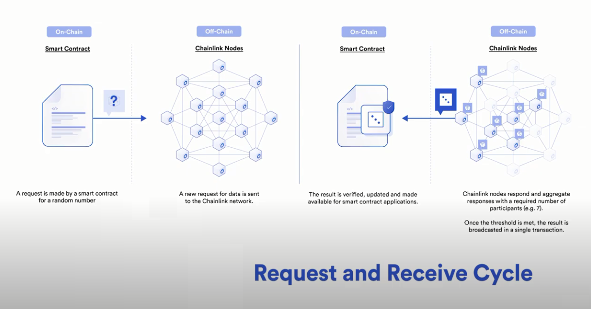

##
## Link Betting Game
Major Topics Learned:
- deployment to testnet (Rinkeby) -> network specific contract interaction
- use Links pricefeed oracle to get ETH/USD price
- use Links VRF contract to get a random number
- ERC677 Token (LINK) -> makes working with oracles easier
- callback interaction with another contract
- commenting out unused variables to suppress warnings
- use of mapping to allow multiple pending states (bets) to ensure proper payouts 
- using for loops in smart contracts for pending processes
- dynamically adjusting account balances withou refreshing the page
- react -> "componentWillMount" removed & "componentDidMount" used  

Resources:
- tutorial on Betting Game (from: [Dapp University](https://www.youtube.com/watch?v=YzCbaR15Xi4&t=971s))
- tutorial for getting a random number from [ChainLink](https://www.youtube.com/watch?v=JqZWariqh5s)
##
**NOTE**: My code has been modified and updated to fix general use bugs present in the Dapp University 
tutorial. MetaMask and React have gone through some changes which I have updated along with making the code
cleaner and easier to read (front-end).  

**Updates**:
- switch to componentWillMount (updated to react 17.0.1)
- changed metamask connection to reflect their latest changes (use our web3.js)
- dynamically update navbar account when we are not on the correct network
- dynamically update account balance once transaction is sent to smart contract
- allow user to bet again after account has updated (even with a pending result)
- filter events so that only ones from the user account are shown (in the event of multiple users)
- have metamask pop up to log in when page loads
- clean up dead/redundant code
##
## Design

## Instructions
The front end will display the current connected account in the upper right hand corner along with the 
users balance in the lower right of the app.  The user can place a bet for any amount between the min and 
max bet amounts.  There is a 50/50 change of getting the outcome is either "high" or "low".  There payout is
1-1 (ie. if you bet 1 eth and win, you receive 1 eth ).It takes a considerable amount of time to get a result back,
roughly 1-2 min on the rinkeby network.  

To play the game, please use the faucet below to get ETH and fund your smart contract with both ETH & LINK.

- Use Rinkeby test network and get funds from faucet
	- https://faucet.rinkeby.io/
	- request funds via twitter and then paste link to tweet and select the amount of eth you want
- Go to Link faucet and paste metaMask account
	- https://rinkeby.chain.link/
	- click on add token and copy/paste link address from smart contract

## UI

