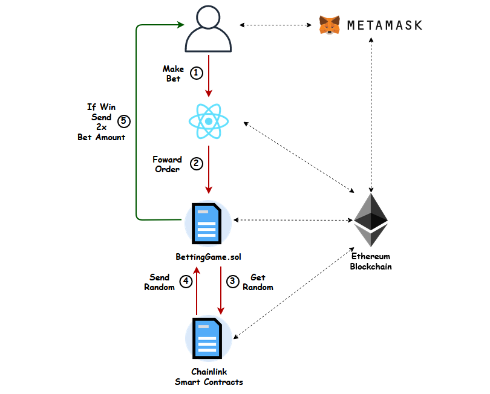
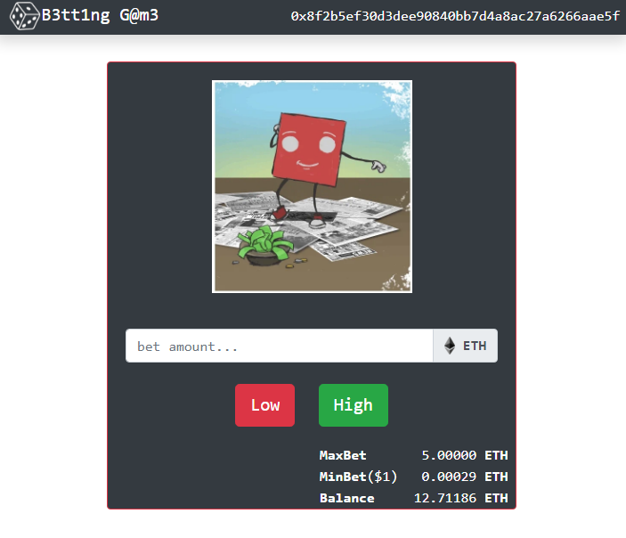

##
## Link Betting Game
Major Topics:
- tutorial on ChainLink's random number contract (from: [Dapp University](https://www.youtube.com/watch?v=YzCbaR15Xi4&t=971s))
- deployment to testnet (Rinkeby)

## Design



## Instructions
- Use Rinkeby test network and get funds from faucet
	- https://faucet.rinkeby.io/
	- request funds via twitter and then paste link to tweet and select the amount of eth you want
- Go to Link faucet and paste metaMask account
	- https://rinkeby.chain.link/
	- click on add token and copy/paste link address from smart contract

```
contract address:    0xD2513257A3dC8918c5f04cCEB1Fb10d82644aaEE
account:             0x8f2B5EF30D3DEe90840bb7D4a8aC27A6266aAe5F
```

## UI


